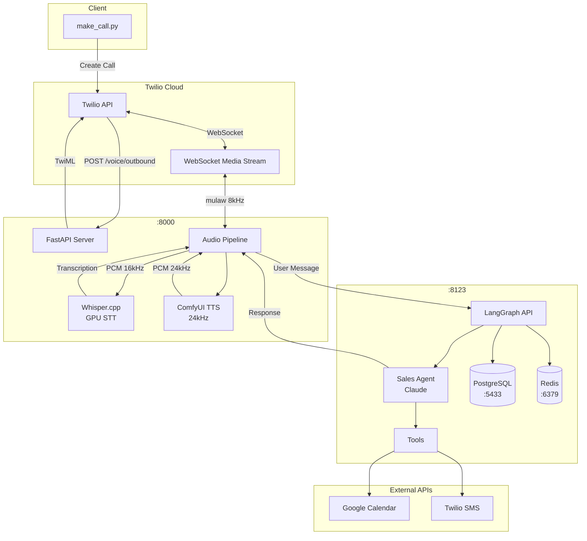
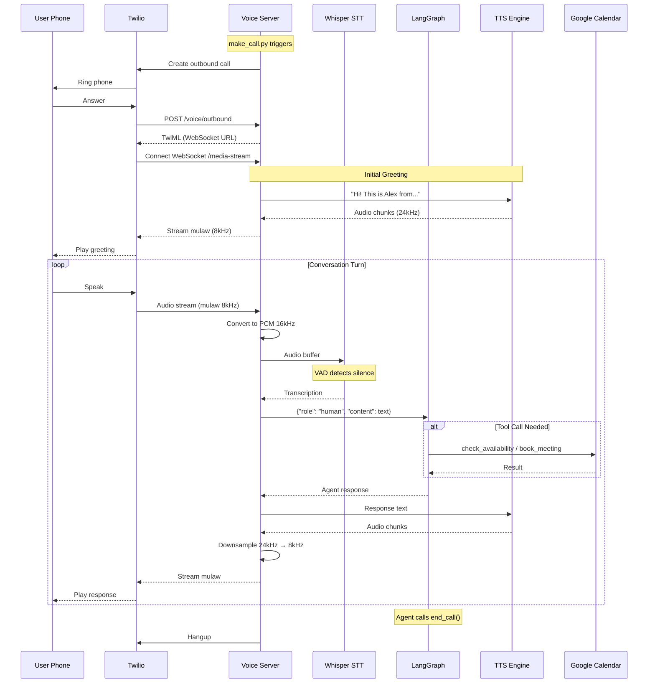

# Voice AI SDR Agent

An autonomous AI Sales Development Representative that makes outbound sales calls, qualifies leads, and books meetings - all without human intervention.

## Features

- **Outbound Calling** - Initiates calls via Twilio with real-time bidirectional audio
- **Natural Conversations** - Claude-powered agent with strict turn-taking rules
- **Calendar Integration** - Checks Google Calendar availability and books 15-min demos
- **SMS Booking Links** - Sends booking forms via SMS (avoids spelling errors over phone)
- **Voice Activity Detection** - Adaptive VAD for natural interruption handling
- **Persistent Memory** - LangGraph Platform with PostgreSQL for conversation continuity

## System Architecture



## Call Flow



## Quick Start

### Prerequisites

- Python 3.12+
- Docker & Docker Compose
- NVIDIA GPU (for Whisper.cpp)
- ngrok account
- API Keys: Twilio, OpenAI/Anthropic, Google Calendar OAuth

### Installation

```bash
git clone https://github.com/Rajathbharadwaj/voice-agent.git
cd voice-agent

python -m venv venv
source venv/bin/activate
pip install -e .

cp .env.example .env
# Edit .env with your API keys
```

### Google Calendar Setup

```bash
python scripts/auth_google_calendar.py
# Opens browser for OAuth consent
# Saves token to data/google_token.pickle
```

### Start Services

```bash
# 1. Start Docker (PostgreSQL + Redis)
docker compose up -d langgraph-postgres langgraph-redis

# 2. Start LangGraph Platform
langgraph dev --port 8123

# 3. Start Voice Server (new terminal)
python -m uvicorn src.sdr_agent.server:app --host 0.0.0.0 --port 8000

# 4. Start ngrok tunnel (new terminal)
ngrok http 8000
# Update NGROK_URL in .env with the https URL
```

### Make a Test Call

```bash
python make_call.py +1234567890
```

## Environment Variables

```bash
# Twilio
TWILIO_ACCOUNT_SID=ACxxxxx
TWILIO_AUTH_TOKEN=xxxxx
TWILIO_PHONE_NUMBER=+1234567890

# LLM (Claude recommended)
LLM_MODEL=anthropic:claude-opus-4-5-20251101
OPENAI_API_KEY=sk-xxxxx  # or ANTHROPIC_API_KEY

# LangGraph Platform
LANGGRAPH_URL=http://localhost:8123

# ngrok (required for Twilio webhooks)
NGROK_URL=https://xxxx.ngrok-free.app

# Google Calendar
MOCK_CALENDAR=false  # Set true to use mock calendar

# Booking System
CUA_API_URL=https://app.paralleluniverse.ai  # Optional external booking API
```

## Project Structure

```
voice-agent/
├── src/sdr_agent/
│   ├── agent/
│   │   ├── graph.py           # LangGraph StateGraph definition
│   │   ├── prompts.py         # System prompt & call flow rules
│   │   ├── sales_agent.py     # Agent wrapper & session management
│   │   └── tools.py           # 6 agent tools (calendar, SMS, etc.)
│   ├── integrations/
│   │   └── google_calendar.py # Calendar API integration
│   ├── telephony/
│   │   ├── twilio_client.py   # Twilio REST API client
│   │   └── media_stream.py    # WebSocket audio handling
│   ├── pipeline.py            # STT → Agent → TTS orchestration
│   ├── server.py              # FastAPI endpoints & WebSocket handler
│   └── booking_form.py        # HTML booking form & submission
├── scripts/
│   └── auth_google_calendar.py
├── data/                      # Credentials & tokens
├── docker-compose.yml         # PostgreSQL + Redis
├── langgraph.json            # LangGraph Platform config
└── make_call.py              # CLI to initiate calls
```

## Agent Tools

| Tool | Signature | Purpose |
|------|-----------|---------|
| `check_availability` | `(day: str)` | Get free calendar slots for a day |
| `send_booking_link` | `(day, time, contact_name)` | Send SMS with booking form link |
| `book_meeting` | `(day, time, contact_name, contact_email)` | Create calendar event directly |
| `request_callback` | `(day, time)` | Schedule a callback |
| `end_call` | `(outcome)` | End call with outcome tracking |
| `add_note` | `(note)` | Record info during call (silent) |

**Outcomes:** `meeting_booked`, `interested`, `callback_requested`, `not_interested`, `wrong_number`, `voicemail`, `hostile`

## Audio Pipeline

```
Twilio Input          Voice Server              Twilio Output
─────────────         ────────────              ─────────────
mulaw 8kHz    ───►    PCM 16kHz    ───►         mulaw 8kHz
(G.711)               (Whisper)                 (G.711)
                           │
                           ▼
                      Transcription
                           │
                           ▼
                    LangGraph Agent
                           │
                           ▼
                      TTS (24kHz)
                           │
                           ▼
                    Downsample 8kHz
```

## Key Design Decisions

### httpx Instead of SDKs

The Twilio and Google Calendar Python SDKs cause "maximum recursion depth exceeded" errors when running inside LangGraph Platform due to HTTP client instrumentation conflicts. We bypass this by using `httpx` directly:

```python
# Instead of: twilio_client.messages.create(...)
with httpx.Client() as client:
    response = client.post(
        f"https://api.twilio.com/.../Messages.json",
        auth=(account_sid, auth_token),
        data={"To": to, "From": from_, "Body": message}
    )
```

### Context via RunnableConfig

Since tools run in a separate LangGraph process, call context (phone number, call SID, etc.) is passed via LangGraph's `config.configurable` metadata:

```python
result = await langgraph_client.runs.wait(
    thread_id,
    "sales_agent",
    input={"messages": [...]},
    config={"configurable": {"phone_number": "+1...", "call_sid": "CA..."}}
)
```

### Single Question Per Response

The agent prompt enforces strict turn-taking:
- Ask only ONE question per response
- STOP talking immediately after the question mark
- Never combine questions with additional information

This prevents the agent from talking over the user.

## TTS Engine Options

| Engine | Latency | Config |
|--------|---------|--------|
| ComfyUI (default) | ~1s | Requires ComfyUI with ChatterboxTTS node |
| Kokoro ONNX | ~600ms | Local ONNX model |
| MiraTTS | ~100ms | Voice cloning with reference audio |

Configure in `pipeline.py`:
```python
tts_engine: str = "comfyui"  # or "kokoro", "mira"
```

## License

MIT
